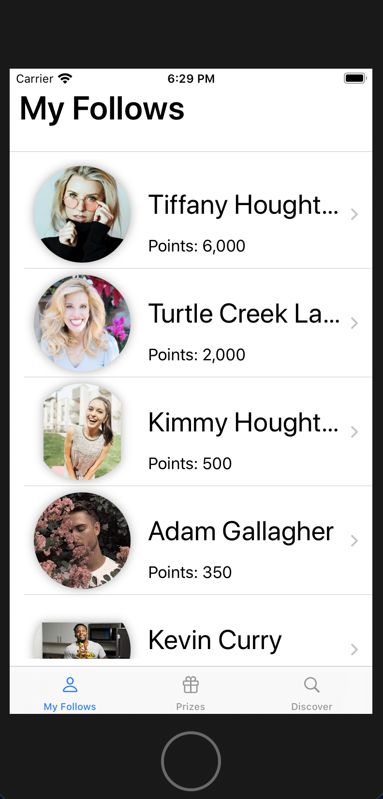
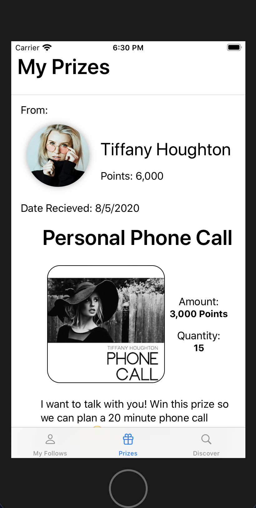
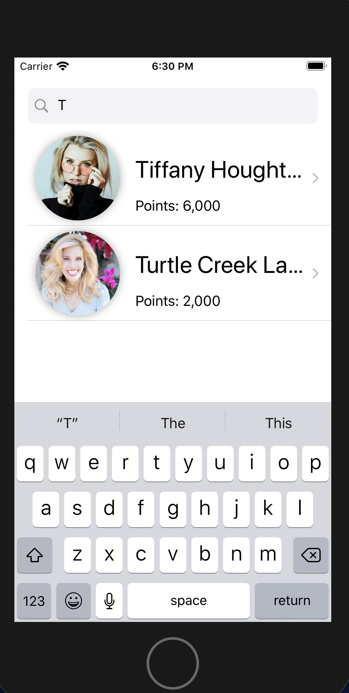
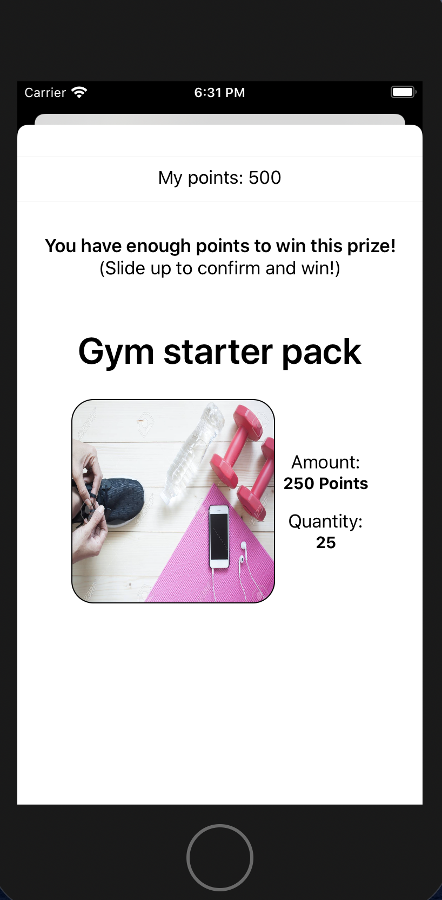
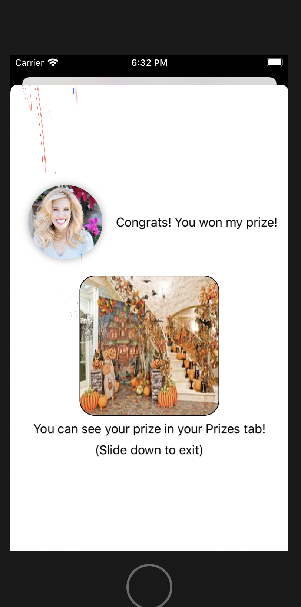

# influencer-marketplace

## Description
This is a functional prototype with a comprehensive front-end UI for an iOS app where followers can win prizes from their favorite influencers.\
Programmed in SwiftUI.\

## Instructions to run

The app should open preloaded with all necessary data. (Pictures are preloaded in Assets and the Sound file is preloaded under Sounds).\
All of the data regarding which influencers and prizes are on the platform are also hardcoded into the file ExampleData.\
Simply open the Xcode project and run in Xcode\

## Implemented APIs in SwiftUI

-EnvironmentObject\
-Observed Object\
-Published\
-Publisher\
-Geometry Reader\
-List\
-Button\
-Navigation View\
-Image\
-State\
-Binding\
-Explicit Animation\
-Implicit Animation\
-Custom View Modifiers\
-Sheet\
-Alert\
-User defaults\
-Gesture (Drag Gesture)\
-Sound effects\
-TextField\
-Animatable\
-Tabs\

## Views

### My Follows View
The app opens in the My Follows view. The influencers you follow are preloaded. Scroll through and click on one to view their page and their prizes.\

### Influencer Page View
While scrolling through an influencer's available "prizes" on their page, click on the redeem button to "win" it if you have enough points.\
If you click on a redeem button for a prize you already have, an Alert will appear saying you already have this prize.\
If you click on a redeem button for a prize that you can't afford, an Alert will appear telling you so.\

### My Prizes View
Every time you win a prize, a "reciept" will appear under the Prizes tab\

### Influencer Search Bar View
In the discover tab, you are able to search for influencers.\
Results will update dynamically as you type (for example, Tiffany Houghton) with fade-in implicit animation.\
For example, after just typing "T", Tiffany Houghton and Turtle Creek Lane's thumbnail's will appear.\
If you click on a thumbnail, it will take you to their page.\

### Confirm Purchase Sheet
If you click on a redeem button for a prize you don't have and can afford, a sheet will appear prompting you to slide up on the Prize view in order to confirm your "win."\

###Successful Purchase Sheet
If you slide up, you will have purchased the prize, and a congratulations message will be displayed with explicit animation on the sheet and a sparkle sound effect will play.

