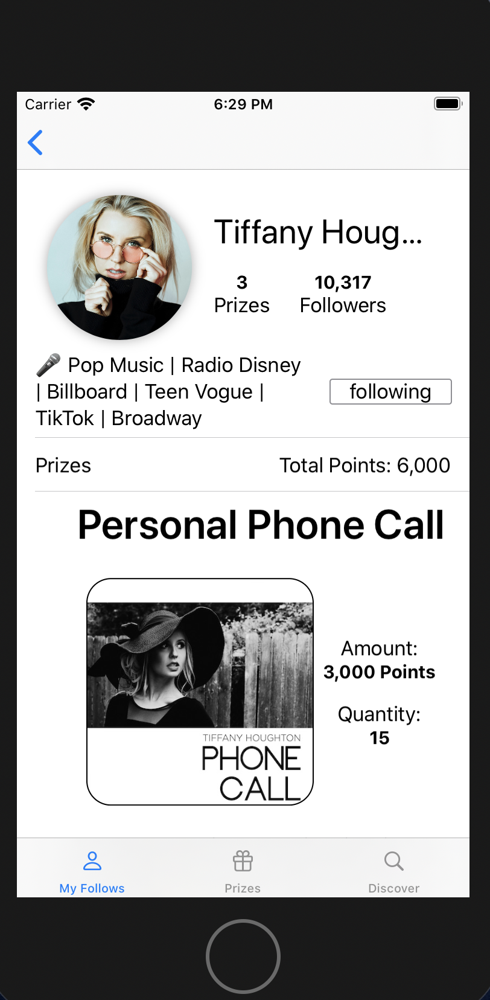

# influencer-marketplace

## Description
This is a functional prototype with a comprehensive front-end UI for an iOS app where followers can win prizes from their favorite influencers. Programmed in SwiftUI.

## Instructions to run

The app should open preloaded with all necessary data. (Pictures are preloaded in Assets and the Sound file is preloaded under Sounds).
All of the data regarding which influencers and prizes are on the platform are also hardcoded into the file ExampleData.
Simply open the Xcode project and run in Xcode

## Implemented APIs in SwiftUI

-EnvironmentObject
-Observed Object
-Published
-Publisher
-Geometry Reader
-List
-Button
-Navigation View
-Image
-State
-Binding
-Explicit Animation
-Implicit Animation
-Custom View Modifiers
-Sheet
-Alert
-User defaults
-Gesture (Drag Gesture)
-Sound effects
-TextField
-Animatable
-Tabs

## Sample Photos

### My Follows View

### Influencer Page View

### My Prizes View

### Influencer Search Bar View

### Confirm Purchase Sheet

###Successful Purchase Sheet

